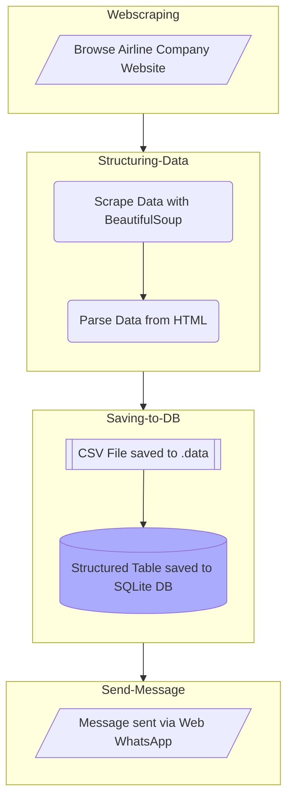

# Flight Prices Project 🛪
*Gathering airline ticket fares in a SQL DB.*

For the full **Documentation**: [Documentation Page MkDocs](https://gurezende.github.io/Flight_Prices/).

## Problem and Description

This project was created to fulfill the problem of getting flight ticket prices on a weekly basis for a future study about how the prices behave thoughout an year.

So, the scripts will:

1. Navigate to the airline company website and get flight ticket fares for the given date.
2.  Scrape the results
    * This was accomplished with `Selenium`.    
3. Parse departure and arrival city, time and date, flight length, number of stops and ticket price.
    * Done with `BeautifulSoup`.
4. Store the structured data in a SQL DB
    * Stored in `SQLite 3`.
5. Send a message via WhatsApp with the flight with the lowest price and the average price of the flights for that date.
    * Done with `pywhatkit`.

### Notes

* All the prices are in BRL (Brazilian Real)
* The flight length is in hours.

## Python Version

This project was created with **Python 3.12.1**.

## Requirements

* `uv` | `bs4` | `mkdocs` | `mkdocstrings-python` | `mkdocs-mermaid2-plugin` | `numpy` | `polars` | `pywhatkit` | `requests` | `selenium`

* You need *Google Chome* browser to run this project.

## Log

This is an ongoing project where I am creating a script to get dates and prices of a selected flight.

*Latest update*:
* 2024-12-03 : Program can fetch flights information from website, parse and load to SQLite.
* 2024-12-04 : Added message sent via Whatsapp.
* 2024-12-06 : Added documentation.
* 2024-12-09 : Medium article.

## Project Layout

